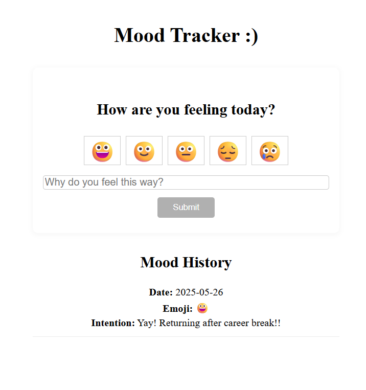

# Mood Tracker App

This is a simple mood tracker application built with React, Redux, and Vite. Users can input their mood using emojis, intentions and view the feed.

Preview:



### Install dependencies

```bash
npm install
```

### Start the development server

```bash
npm run dev
```
